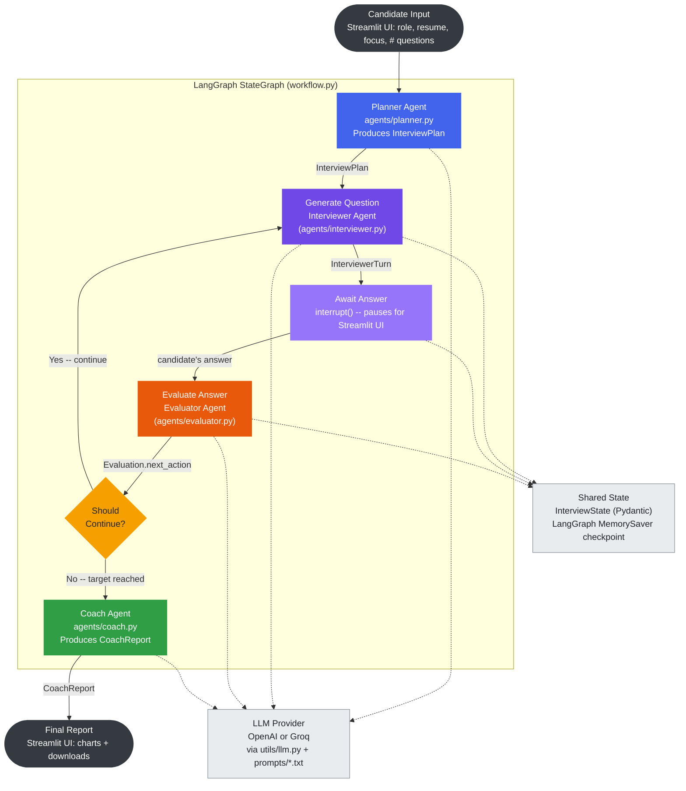

# AI Mock Interview Coach 🎯

A multi-agent AI system that conducts a realistic, adaptive mock interview and delivers a
detailed coaching report at the end — built with **LangGraph**, **LangChain**, **Streamlit**, and
a pluggable LLM layer that runs on either **OpenAI** or **Groq** (this deployment runs on Groq's
free tier).

This is not three sequential LLM calls dressed up as "agents." Each agent has a distinct role,
a distinct persona, distinct inputs/outputs, and the orchestration graph makes real branching
decisions (follow up vs. move on vs. hint vs. redirect vs. end) based on structured output from
the previous agent.

📖 **New here?** [`docs/SETUP.md`](docs/SETUP.md) has step-by-step install instructions and a
troubleshooting table; [`docs/USER_GUIDE.md`](docs/USER_GUIDE.md) walks through using the app
once it's running. This README covers architecture, design decisions, and how it all works.

---

## Table of Contents

- [Project Overview](#project-overview)
- [Features](#features)
- [Architecture](#architecture)
- [Agent Design](#agent-design)
- [Prompt Design](#prompt-design)
- [Grounding (RAG)](#grounding-rag)
- [Installation](#installation)
- [Environment Variables](#environment-variables)
- [How to Run](#how-to-run)
- [Live Deployment](#live-deployment-streamlit-community-cloud)
- [Folder Structure](#folder-structure)
- [Scoring Rubric](#scoring-rubric)
- [Edge Case Handling](#edge-case-handling)
- [Key Design Decisions & Tradeoffs](#key-design-decisions--tradeoffs)
- [Future Improvements](#future-improvements)
- [Example Interview Transcripts](#example-interview-transcripts)
- [Screenshots](#screenshots)

---

## Project Overview

The candidate provides a **target role**, an optional **resume/background snippet**, and a
**focus area** (technical / behavioral / system design / mixed). The system then:

1. **Plans** an interview strategy tailored to that candidate (Planner Agent).
2. **Conducts** a configurable-length (1-15 question) adaptive interview, one question at a time, escalating or
   simplifying based on performance (Interviewer Agent).
3. **Evaluates** every single answer across 7 rubric dimensions before the next question is
   generated (Evaluator Agent).
4. **Coaches** the candidate with a structured, honest, encouraging report once the interview
   ends (Coach Agent).

## Features

- 🧠 4 distinct LLM agents (Planner, Interviewer, Evaluator, Coach) orchestrated as a LangGraph
  state machine — not a linear script.
- 🔁 Real adaptivity: follow-up questions, hints, redirects, and difficulty escalation are all
  driven by the Evaluator's structured `next_action`, not hardcoded rules on raw text.
- 📊 A deterministic scoring engine (`utils/scoring.py`) — the LLM never does the final grade
  arithmetic; it narrates around numbers computed in plain Python for auditability.
- 💬 Clean Streamlit UI: intake form → one-question-at-a-time chat → sidebar live status → final
  report page with charts.
- 🧵 Robust to messy real answers: empty input, "I don't know", off-topic replies, hallucinated
  claims, repeated answers, and rambling long answers are all explicitly handled (see
  [Edge Case Handling](#edge-case-handling)).
- 📥 Export the transcript/report as `.txt`, `.md`, or `.pdf`.
- 📈 Rubric bar chart + per-question score trend line chart.
- ⏱️ Configurable interview length (1-15 questions) with a live per-question stopwatch and a
  time-per-question breakdown in both the sidebar and the final report.
- 🔢 Token usage tracking in the sidebar.
- 🌙 Dark theme by default (`.streamlit/config.toml`).
- 🔎 **Grounding (lightweight RAG)**: the Planner's topic selection is informed by a curated
  role-specific question bank + current interview-trend notes, with an optional live web-search
  upgrade path — see [Grounding (RAG)](#grounding-rag).

## Architecture

An editable version of this diagram is available in two formats:
- **[`docs/architecture.drawio`](docs/architecture.drawio)** — open in [diagrams.net](https://app.diagrams.net) (File → Open From → Device), or in Lucidchart via File → Import → "draw.io".
- **Lucidchart** (already created, live and editable): https://lucid.app/lucidchart/4d75d491-b13b-411d-9218-fe48767002fb/edit



*(Dashed lines = every LLM-calling agent goes through the same provider wrapper and reads/writes
the same shared state; solid lines = the actual control flow.)*

This is implemented as a `langgraph.graph.StateGraph` over a single shared Pydantic state object
(`InterviewState`, see `models/schemas.py`). See [`workflow.py`](workflow.py).

**Why two nodes for one question (`generate_question` + `await_answer`)?** LangGraph's
`interrupt()` re-runs its *entire enclosing node* from the top when the graph is resumed. If the
Interviewer's LLM call happened in the same node as the `interrupt()` call, every resume would
silently re-generate (and re-bill) a new question. Splitting question-generation (has a side
effect) from answer-waiting (pure, cheap, idempotent) avoids that trap entirely — see the
docstring at the top of `workflow.py` and the mocked test that asserts the Interviewer Agent is
called exactly once per question, not once per resume.

## Agent Design

| Agent | File | Runs | Role |
|---|---|---|---|
| **Planner** | `agents/planner.py` | Once, at start | Infers seniority from role + background, picks starting difficulty, focus, 4-6 concrete topics, and a strategy. Never asks questions itself. |
| **Interviewer** | `agents/interviewer.py` | Once per question | Asks exactly one question at a time. Reads the Evaluator's `next_action` to decide: escalate to a new concept, ask a deeper follow-up, give a hint, or redirect politely. Owns difficulty pacing and interview length (candidate-chosen, 1-15 Qs). |
| **Evaluator** | `agents/evaluator.py` | Once per answer | Scores every answer on 7 dimensions (technical, communication, confidence, accuracy, clarity, problem_solving, depth), flags red flags (fabrication, repetition), and emits the `next_action` the Interviewer consumes. Never sees or produces candidate-facing text. |
| **Coach** | `agents/coach.py` | Once, at end | Synthesizes the full transcript + evaluations into a structured report: strengths, weaknesses, per-category feedback, question-by-question review, and a concrete practice plan. Numeric scores are handed to it pre-computed — it narrates, it doesn't grade. |

Each agent is a plain Python function that: loads its own prompt file, formats the current
`InterviewState` into a context block, calls the LLM via `utils/llm.call_llm_json`, and returns
a validated Pydantic object. No agent imports another agent — all coordination happens in
`workflow.py`.

## Prompt Design

Every agent's prompt (`prompts/*.txt`) follows the same structure: **Role → Goal → Persona →
Responsibilities → Rules → Output Format (strict JSON schema) → Constraints → Worked Examples →
Failure Handling → Edge Cases**. A few choices worth calling out:

- **JSON-only outputs, parsed defensively.** `utils/parser.extract_json` handles markdown-fenced
  JSON, leading/trailing commentary, and raw JSON — and `utils/llm.call_llm_json` retries with
  the parse error fed back to the model up to twice before giving up. This matters more than it
  sounds: even well-prompted models occasionally wrap JSON in a sentence.
- **The Evaluator is explicitly told how to score honesty vs. false confidence differently** — a
  hedged "I'm not sure, but I think..." with a knowledge gap should score *higher* on accuracy
  than a fabricated, confidently-stated wrong answer, and only the latter should generate a red
  flag. This directly drives the "confidently fabricated claim" edge case in transcript #3.
- **The Coach is told to echo pre-computed numbers, not recompute them**, and the code
  overwrites `overall_score` / `overall_percentage` / `readiness_level` after parsing regardless
  — belt and suspenders against LLM arithmetic drift.
- **The Interviewer prompt caps follow-up chains** ("after at most 2 follow-ups on one topic,
  move on") so a single weak topic can't consume the whole question budget, whatever length the candidate chose.

## Grounding (RAG)

The assignment brief calls grounding optional -- "don't build it unless it makes the prototype
meaningfully better." It's included here because it directly improves the one place quality is
most visible: the Planner's topic selection. Without grounding, topics come purely from the
LLM's own (sometimes generic) assumptions about a role. With it, the Planner is handed real
reference material and asked to use it the way an experienced interviewer would.

**How it works** (`utils/grounding.py`, wired into `agents/planner.py` only):

1. The candidate's target role is matched against `knowledge/question_bank.json` -- a small,
   curated set of real-world topics and representative question themes for ~10 common roles
   (frontend, backend, data analyst, PM, DevOps, etc.), via plain keyword matching. No embedding
   model or vector DB needed for a knowledge base this size.
2. A short excerpt from `knowledge/interview_trends.md` (curated notes on how interviews are
   actually run today -- e.g. AI-assisted coding review, earlier system design rounds) is
   appended.
3. This block is injected into the Planner's prompt as "REFERENCE MATERIAL," with explicit
   instructions to use it as inspiration for realistic topics, not as a script to copy from (see
   the GROUNDING section of `prompts/planner_prompt.txt`).
4. Which source was actually used (`web_search`, `local_question_bank`, or `none`) is stored on
   `InterviewPlan.grounding_source` -- set deterministically in code after parsing, same pattern
   as the Coach's numeric scores -- and shown in the Streamlit sidebar's "Interview Plan"
   expander for transparency.

**Why local-first instead of always hitting the web:** a bundled, curated knowledge base has no
extra API key, no rate limits, no network flakiness, and no risk of an interview silently
degrading because a search call failed mid-session -- it always works the moment you clone the
repo. Live web search is a strict upgrade when available, not a requirement to get grounding at
all.

**Optional live upgrade:** set `TAVILY_API_KEY` in `.env` (free tier, no cost) and the Planner
automatically switches to live web search results instead of the local bank for that plan --
useful if you want genuinely current results rather than a curated snapshot. Any failure
(missing key, network error, rate limit) silently falls back to the local bank; grounding is a
quality enhancement the interview flow can never break on.

**Scope note:** grounding is wired into the Planner only, not the Interviewer/Evaluator/Coach.
Downstream agents already inherit grounded topics through `InterviewPlan.topics`, so grounding
every agent independently would add complexity without adding signal -- exactly the kind of
overbuilding the assignment brief warns against.

## Installation

```bash
git clone <this-repo-url>
cd AI-Mock-Interview-Coach
python -m venv .venv
# Windows:
.venv\Scripts\activate
# macOS/Linux:
source .venv/bin/activate

pip install -r requirements.txt
cp .env.example .env   # then edit .env and add your API key
```

Requires **Python 3.11+**.

## Environment Variables

Set these in a `.env` file (see `.env.example`). The system supports two LLM providers behind
one switch — OpenAI (the original spec) or Groq (free tier, good for development):

| Variable | Required | Default | Description |
|---|---|---|---|
| `LLM_PROVIDER` | No | `openai` | `"openai"` or `"groq"`. |
| `OPENAI_API_KEY` | ✅ if provider is `openai` | — | Your OpenAI API key. Never commit this. |
| `GROQ_API_KEY` | ✅ if provider is `groq` | — | Free key from [console.groq.com/keys](https://console.groq.com/keys). Never commit this. |
| `LLM_MODEL` | No | `gpt-4.1` (openai) / `llama-3.3-70b-versatile` (groq) | Override the model for whichever provider is active. |
| `LLM_TEMPERATURE` | No | `0.4` | Default sampling temperature (each agent also sets its own tuned value). |
| `ENABLE_GROUNDING` | No | `true` | Set `false` to disable Planner grounding entirely (see [Grounding (RAG)](#grounding-rag)). |
| `TAVILY_API_KEY` | No | — | Optional free key ([tavily.com](https://tavily.com)) to upgrade grounding from the local question bank to live web search. |

## How to Run

```bash
streamlit run app.py
```

Then open the local URL Streamlit prints (usually `http://localhost:8501`). Fill in the target
role (required), an optional background snippet, and a focus area, then click **Start
Interview**. Answer one question at a time; the sidebar shows live score, current difficulty,
and topics covered. After the chosen number of questions, the Coach Agent's report renders automatically with
downloadable transcript/report files.

## Live Deployment (Streamlit Community Cloud)

The app is ready to deploy on [Streamlit Community Cloud](https://share.streamlit.io) as-is --
free, and it connects directly to this GitHub repo. Deploy your own copy:

1. Go to [share.streamlit.io](https://share.streamlit.io) and sign in with GitHub.
2. Click **New app**, select this repository, branch `main`, and main file `app.py`.
3. Before (or right after) deploying, open **Advanced settings -> Secrets** and paste in your
   config -- use [`.streamlit/secrets.toml.example`](.streamlit/secrets.toml.example) as the
   template (same variables as `.env.example`, just TOML syntax):
   ```toml
   LLM_PROVIDER = "groq"
   GROQ_API_KEY = "gsk_your_key_here"
   ```
4. Click **Deploy**. First build takes a few minutes (installing `requirements.txt`); the app
   redeploys automatically on every push to `main`.

**How secrets reach the app:** Streamlit Cloud's secrets manager exposes config via `st.secrets`,
not `os.environ` directly -- but the rest of the codebase (`utils/llm.py`) reads config via
`os.getenv(...)`, the same as local `.env` development. `app.py` bridges the two: at startup, it
copies everything in `st.secrets` into `os.environ` *before* importing any project modules (see
the comment at the top of `app.py`), so `utils/llm.py`'s module-level config reads pick it up
correctly whether you're running locally or deployed. Locally, where there's no `secrets.toml`,
this bridge is a harmless no-op and `.env` (via `python-dotenv`) takes over instead.

**Note:** `runtime.txt` pins the deployed Python version to 3.11 for compatibility with Streamlit
Cloud's supported runtimes, independent of whatever Python version you use locally.

## Folder Structure

```
AI-Mock-Interview-Coach/
│
├── agents/                  # One file per agent -- thin, LLM-calling functions
│   ├── planner.py
│   ├── interviewer.py
│   ├── evaluator.py
│   └── coach.py
│
├── prompts/                  # Every agent's system prompt as its own text file
│   ├── planner_prompt.txt
│   ├── interviewer_prompt.txt
│   ├── evaluator_prompt.txt
│   └── coach_prompt.txt
│
├── utils/
│   ├── llm.py                # Chat model wrapper (OpenAI/Groq), JSON-mode retries, token tracking
│   ├── parser.py              # Robust JSON extraction from raw LLM text
│   ├── scoring.py             # Deterministic rubric aggregation / readiness level
│   └── grounding.py           # Lightweight RAG: local question bank + optional live web search
│
├── models/
│   └── schemas.py             # Every Pydantic model shared across agents + graph state
│
├── knowledge/                 # Grounding knowledge base (see Grounding (RAG) section)
│   ├── question_bank.json     # Curated role-specific topics + sample question themes
│   └── interview_trends.md    # Curated notes on current interview trends
│
├── sample_transcripts/        # 3 example interviews: strong / weak / edge-case-heavy
│
├── docs/
│   ├── SETUP.md                # Step-by-step install guide + troubleshooting
│   ├── USER_GUIDE.md            # How to use the running app, phase by phase
│   └── architecture.drawio      # Editable architecture diagram (draw.io / Lucidchart import)
│
├── app.py                     # Streamlit UI
├── workflow.py                 # LangGraph StateGraph wiring all 4 agents together
├── requirements.txt
├── runtime.txt                  # Pins Python 3.11 for Streamlit Cloud
├── .env.example                 # Local dev config template
├── .streamlit/config.toml       # Dark theme
├── .streamlit/secrets.toml.example  # Streamlit Cloud config template
└── README.md
```

## Scoring Rubric

Every answer is scored 0-10 on: **Technical Knowledge, Communication, Confidence, Problem
Solving, Depth, Accuracy, Clarity**. The Coach's overall score is the mean of all per-dimension
averages across the interview, computed deterministically (`utils/scoring.py`):

| Overall Score | Readiness Level |
|---|---|
| ≥ 8.5 | Outstanding |
| 6.5 – 8.4 | Job Ready |
| 4.0 – 6.4 | Intermediate |
| < 4.0 | Beginner |

Hire recommendation additionally downgrades to "No Hire" if 3+ red flags (e.g. fabricated
claims) were raised during the interview, regardless of raw score.

## Edge Case Handling

| Case | Handling |
|---|---|
| Empty / whitespace-only answer | Treated identically to "I don't know" — scored low but honestly, no red flag, Interviewer gives a hint. |
| "I don't know" | Evaluator sets `next_action=give_hint`; Interviewer gives a scoped hint, never the full answer, then continues same topic. |
| Off-topic / non-answer | Evaluator sets `next_action=redirect`; Interviewer politely steers back without scolding. |
| Hallucinated/fabricated claim | Evaluator adds a specific `red_flags` entry and lowers `accuracy`; Interviewer probes for specifics rather than accusing outright. |
| Repeated answer | Evaluator detects near-duplicate answers against prior history, flags it, caps `problem_solving`. |
| Very long / rambling answer | Truncated to a safe prompt length (`utils/parser.truncate_for_prompt`); Evaluator credits real substance but lowers `clarity`/`communication`. |
| Topic switching mid-interview | Interviewer can move to a new plan topic once evaluation says `next_concept`; doesn't force finishing every topic in order. |
| Difficulty runaway | Difficulty only shifts one notch at a time, floored at "easy", and only re-assessed when moving to a new concept, never mid-follow-up. |
| Candidate stuck on one question | After 2 consecutive stuck responses (weak/hint/redirect) on the same topic, `workflow.py`'s `evaluate_node` deterministically sets a `force_new_topic` flag -- not left to the LLM's own judgment. The Interviewer receives a "HARD OVERRIDE" directive on the next turn and must pivot to a different, easier topic with a brief, kind transition, exactly like a real interviewer would rather than grinding on a dead end. |

See [`sample_transcripts/03_edge_cases.md`](sample_transcripts/03_edge_cases.md) for a full
transcript exercising most of these in one interview.

## Key Design Decisions & Tradeoffs

- **LangGraph `interrupt()`/`Command(resume=...)` for human-in-the-loop, instead of a fully
  autonomous loop.** This makes the graph the actual source of truth for interview state
  (with per-thread checkpointing) rather than the Streamlit app hand-rolling a state machine —
  but it does mean question-generation and answer-waiting had to be split into two nodes (see
  Architecture section) to avoid duplicate LLM calls on resume.
- **`MemorySaver` checkpointer (in-process, non-persistent) rather than a database-backed
  checkpointer.** Simple and sufficient for a single-session demo; a production version would
  swap in `SqliteSaver`/`PostgresSaver` for durability across restarts — the graph code itself
  wouldn't need to change.
- **Deterministic scoring in Python, not the LLM.** The Coach agent is given final numbers as
  facts to narrate around, and the code overwrites them post-parse. This trades a small amount
  of "the LLM decides everything" purity for reproducibility and auditability, which matters
  more for something framed as a hiring signal.
- **JSON-only structured outputs via prompt discipline + defensive parsing**, rather than the
  OpenAI-specific `response_format=json_schema` / function-calling mode. This keeps `utils/llm.py`
  provider-agnostic (swapping to another LangChain chat model needs no agent changes) at the
  cost of needing the retry-on-parse-failure logic in `call_llm_json`.
- **Interview length is a soft target (candidate-chosen, 1-15), not a hard cutoff.** The Interviewer can end one
  question early via `is_final_question` or (rarely) go slightly over if a topic needed two
  follow-ups right at the end — this favors interview quality over hitting an exact count.

## Future Improvements

- Persist sessions with a durable LangGraph checkpointer + a lightweight session history browser
  in the UI ("resume a past interview").
- Expand the local grounding knowledge base to more roles, and add an embedding-based retriever
  if/when the question bank grows large enough that keyword matching stops being precise enough
  (see [Grounding (RAG)](#grounding-rag) for the current lightweight approach).
- Extend grounding beyond the Planner -- e.g. letting the Coach's "Resources" section link to
  real, current external material via the same optional web-search backend.
- Streaming token-by-token rendering of Interviewer/Coach output in the UI for a more "live"
  feel (currently full-response, since intermediate JSON can't be meaningfully streamed to the
  candidate before it's complete and validated).
- Multi-candidate analytics dashboard (compare readiness trends across sessions) for coaching-at-
  scale use cases.
- Automated eval harness that replays the sample transcripts' answers through the real agents
  and asserts score ranges, to catch prompt-regression before merging prompt edits.

## Example Interview Transcripts

Three full example interviews are included in [`sample_transcripts/`](sample_transcripts/):

1. **[Strong candidate](sample_transcripts/01_strong_candidate.md)** — Frontend Engineer Intern,
   consistently strong answers, difficulty escalates from easy → hard.
2. **[Weak candidate](sample_transcripts/02_weak_candidate.md)** — Data Analyst, several "I
   don't know"s and misconceptions, difficulty stays at the floor, shows hint-and-recover flow.
3. **[Tricky / edge cases](sample_transcripts/03_edge_cases.md)** — Backend Engineer, deliberately
   exercises off-topic drift, blank input, a fabricated technical claim, a repeated answer, and
   an extremely long rambling response, all in one interview.

## Screenshots

> _Add screenshots of the running app here before submitting — e.g._
> - `docs/screenshot_intake_form.png` — the intake form
> - `docs/screenshot_interview_chat.png` — an in-progress question with the sidebar visible
> - `docs/screenshot_final_report.png` — the final coaching report with charts
